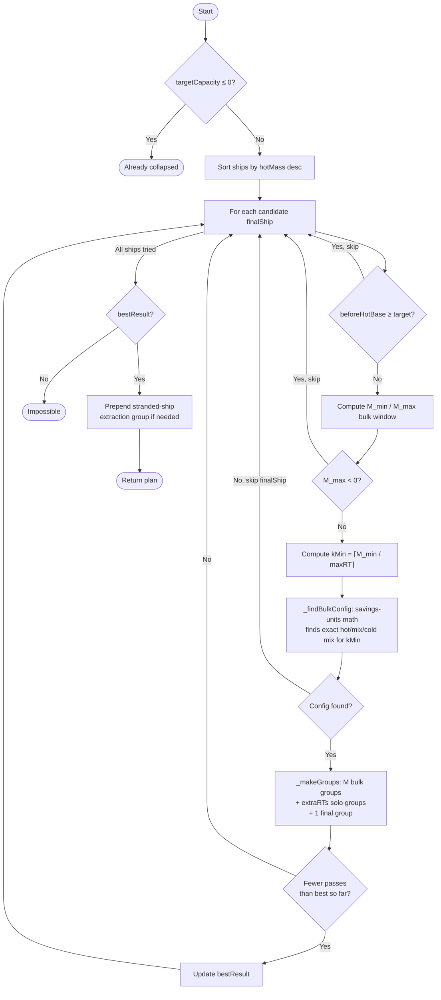

# EVE Online Wormhole Roller

A static web app for tracking wormhole rolling operations in EVE Online.
No server required — runs from any directory or GitHub Pages.

> [!WARNING]
> This repository was completely vibe coded given the low risk nature of the code.
> I have not reviewed the generated code except a simple passing look. It seems to
> work for me, but use at your own risk, especially the locally run index document.
> In particular, **the YAML import/export code has not been reviewed** — do not load
> YAML files from untrusted sources.

## Live App

| Version | URL |
|---|---|
| **Latest (online)** | https://ikogan.github.io/eve-wormhole-roller/ |
| **Latest offline build** | [Download from Releases](https://github.com/ikogan/eve-wormhole-roller/releases/latest) → `eve-wormhole-roller.html` |

### Branch Previews

Every branch prefixed with `cs/` is automatically deployed to GitHub Pages.
To view a branch in your browser, use the pattern:

```
https://ikogan.github.io/eve-wormhole-roller/preview/cs-<branch-name>/
```

For example, branch `cs/add-feature` is accessible at:
```
https://ikogan.github.io/eve-wormhole-roller/preview/cs-add-feature/
```

## Files

| File | Purpose |
|---|---|
| `index.html` | Online version — loads CSS/JS from source files and Vue 3 & js-yaml from CDN. Served via GitHub Pages. |
| `eve-wormhole-roller.html` | Offline version — all scripts and styles fully inlined. Available in each [Release](https://github.com/ikogan/eve-wormhole-roller/releases). |

## Development Workflow

1. Create a branch named `cs/<description>` (e.g. `cs/add-rorqual`)
2. Make changes — push to trigger an automatic preview deployment
3. Preview at `https://ikogan.github.io/eve-wormhole-roller/preview/cs-<description>/`
4. Open a PR to merge into `main`
5. Merging to `main` publishes a new GitHub Release with `eve-wormhole-roller.html`

## GitHub Pages Setup

1. Push the repository to GitHub.
2. Go to **Settings → Pages → Source** and select **Deploy from a branch**, branch **`gh-pages`**, folder **`/ (root)`**.
3. The release workflow will populate the `gh-pages` branch on next push to `main`.

## Running Locally (offline)

Download `eve-wormhole-roller.html` from the [latest release](https://github.com/ikogan/eve-wormhole-roller/releases/latest) and open it in any browser — no internet connection or web server needed.

## Usage

### Setup Tab
1. Enter your wormhole name and total mass (supports both **kg** and **t** — toggle in the header).
2. Set the wormhole size (Small / Medium / Large / XL / XXL) to filter ships and get compat warnings.
3. Set the current game status (Stable / Reduced / Critical / Collapsed).
4. Add ships to your fleet — each ship needs a **Cold mass** (MWD off) and **Hot mass** (MWD active).
5. Export your fleet to YAML for sharing or importing on another device.

### Roll Tab
- Record each pass as it happens — select a ship and choose Hot or Cold, or enter a custom mass.
- The **mass bar** shows used mass, total mass, and the 0–10% variance zone.
- The stats grid shows how much more mass is needed to reach each threshold.
- Ships too heavy for the configured wormhole size are flagged with a warning before recording.
- Remove individual passes or clear all to reset the session.

### Calculator Tab (Roll Plan)
- Calculates the optimal (fewest passes, even count) sequence to collapse the wormhole.
- **Min Mass** — 0% variance: wormhole is exactly as described (fewest passes needed).
- **Max Mass** — 10% variance: wormhole has 10% more mass than shown (most passes needed).
- Calculated off the main thread — a spinner is shown while computing; no browser freezing.
- Ships excluded by the wormhole size setting are listed and removed from plan options.
- Far-side ships (scouts) and stranded ships are accounted for before the rolling plan begins.
- Each planned pass can be overridden between hot and cold; the plan updates downstream mass in real time.

## Rolling Plan Algorithm

The rolling plan is computed in a Web Worker to keep the UI responsive. It runs for both the
**min-mass** (0% variance) and **max-mass** (10% variance) scenarios simultaneously.

### Goal

Produce the shortest sequence of wormhole transits (passes) that:
1. Brings total mass passed through the wormhole into its **collapse window** (100–110% of displayed mass), and
2. Ensures **every pilot that goes through also comes back** — no one is left stranded.

### Structure

The plan is divided into **groups**:

| Group type | Purpose |
|---|---|
| **Stranded** | Ships already on the far side that must return before any new pilots enter |
| **Bulk** | Full N-pilot round-trips — all pilots enter and return together |
| **Solo** | Single-pilot round-trip (remainder after even division) — enter, return, done before next pilot starts |
| **Final** | Collapse pilot cold enter + scout returns + hot collapse pass (⊗) |

The final group's last pass is always a **hot return (⊗)** that tips the wormhole into its collapse range. Only 1 pilot is ever on the far side during the final group.

### Algorithm Steps

```
For each candidate "final ship" (sorted heaviest-hot-mass first):

  1. Compute beforeHotBase = finalShip.coldMass + scoutMassTotal
     (mass consumed before the collapse pass)

  2. Compute the bulk mass window [M_min, M_max] such that:
       bulk + beforeHotBase  <  targetCapacity        (WH still open after scouts return)
       bulk + beforeHotBase + finalShip.hotMass  >=   targetCapacity  (hot return collapses it)

  3. Find minimum K bulk round-trips whose total mass lands in [M_min, M_max].
     Each round-trip is one of:
       hot/hot   = 2 × hotMass   (heaviest)
       hot/cold  = hotMass + coldMass  (mix, saves d kg)
       cold/cold = 2 × coldMass  (lightest, saves 2d kg)

     Savings-units approach (exhaustive, always finds the valid config if one exists):
       n = savings units needed; each hot→cold switch saves d = hotMass − coldMass kg.
       n_min = ⌈(allHotTotal − M_max) / d⌉,  n_max = ⌊(allHotTotal − M_min) / d⌋
       Use n = n_min → coldRTs = ⌊n/2⌋, mixRTs = n mod 2, hotRTs = K − coldRTs − mixRTs.

  4. Distribute K round-trips across groups:
       M full bulk groups  = floor(K / N)   — each: N pilots enter and return together
       Solo groups         = K mod N        — one per remainder pilot, sequential (never concurrent)
       Final group         = 1 pilot only   — cold enter + scout returns + ⊗ hot collapse

  5. Keep the result with the fewest total passes.
```

### Mermaid Flow



### Mass Budget Tracking

The app tracks consumed mass using `effectiveUsedMass`, which is the larger of:
- Sum of all recorded pass masses, or
- The state-floor for the observed wormhole status (50% for Reduced, 90% for Critical) plus any passes recorded after the last state observation.

This ensures that observing a wormhole state change (e.g. "Reduced") immediately shrinks the remaining plan, even if fewer passes have been recorded than the threshold implies.

Pre-configured far-side (scout) ships and stranded manual ships are subtracted from the remaining budget before the plan is sent to the worker, so the rolling sequence only accounts for mass the pilots actually need to transit.

## Notes

- **Passes and wormhole config** are saved to `localStorage` and restored on reload.
- **Ships and wormhole config** are saved to `localStorage` automatically.
- **Even pass count** ensures all ships return to the side they started on.
- The 0–10% variance represents the unknown bonus mass the wormhole can sustain above its displayed total.
- All mass values are stored internally in **kg**; YAML export is always in kg regardless of display unit.

## Source Files

```
eve-wormhole-roller/
├── index.html                      Online app (CDN-dependent)
├── css/
│   ├── themes.css                  17 faction theme palettes
│   └── main.css                    App styles
├── js/
│   └── app.js                      Vue 3 app logic + calculator
└── .github/
    ├── scripts/
    │   └── build-offline.py        Inlines CDN scripts → offline HTML
    └── workflows/
        ├── release.yml             Push to main → GitHub Release + Pages deploy
        └── preview.yml             Push to cs/** → Pages preview deploy
```

## Dependencies (loaded via CDN in `index.html`)

- [Vue 3](https://vuejs.org/) — reactive UI
- [js-yaml 4](https://github.com/nodeca/js-yaml) — YAML import/export


